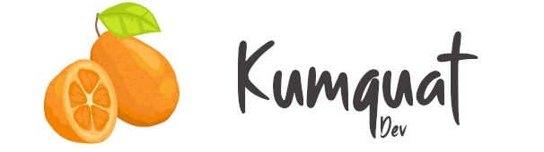

* **[Kumquat Dev](#intro)**
* **[Installation](#installation)**
* **[Available tools](#tools)**
* **[Credits](#credits)**

# Kumquat Dev

Kumquat Dev is a module that includes some Developer experience (DX) 
improvements for [Kumquat](https://github.com/Happyculture/kumquat) based 
projects.

## Installation

- `composer require happyculture/kumquat_dev --dev`
- `drush en kumquat_dev`

## Available tools

### Drush commands

#### drush kumquat:update (kup)

Helper used to update dependencies. It runs `composer update` on the given
dependency then `drush updb`, then `drush cex`, then adds all files to the git
staging and finally offers to create the commit if you want.

Some options allow you to control how the composer update is made, to provide
the issue number to use in the commit message or even to make the commit
without asking if you are very confident. See `drush help kumquat:update`.

#### drush generate pattern

Helper to generate a pattern according to the UI Patterns definition. It asks
you a few questions then creates the directory and needed files so you can
start theming quickly.

# Credits

The font used for the logo is [Smooth Butter from PutraCetol Studio](https://putracetol.com/product/smooth-butter/).
